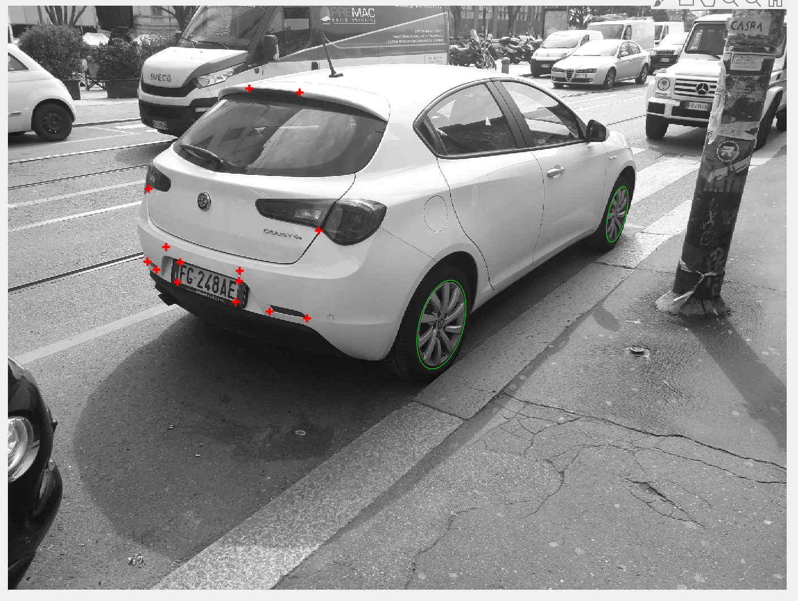
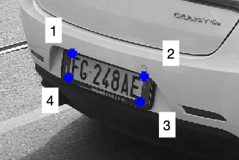
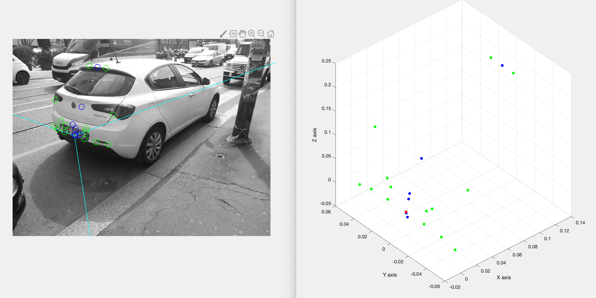
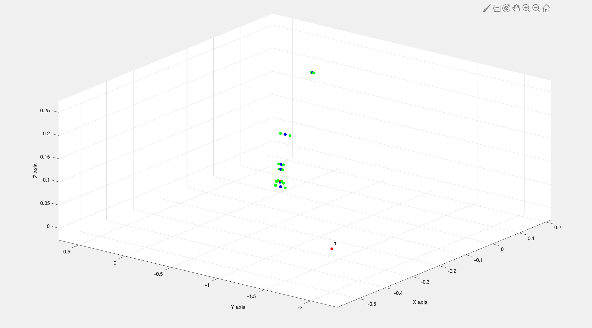

# Homework's report of Mattia Sanchioni
A.Y. 2018/2019


In this homework we have to apply the techniques learned during the lectures in order to complete some tasks.    
Given two images of two different cars we have to find some important features such edges, ellipses or symmetric point. With this information, later, we calibrate the camera (zero-screw, but not natural), localize it and find the position of some points.     

Let's analyze tasks point-wise.

## Extraction of image features
First of all images are uploaded, the photo used in the homework is '_Image1_'.

<div style="text-align: center"></div>

After that it is transformed in grey scaled:
```matlab
% both transformations are equivalent
rgb2gray(image1);
0.299*images(:,:,1) + 0.587*images(:,:,2) + 0.114*images(:,:,3);
```

Now we can start with the first point in which we have to select the most important features useful for the following points.

The approach, that I have used to extract information from image, is to select a restricted area in image.     
In order to do this I wrote the function `selectRegion()` that, given an image, allows to select a section and return the selected region and the coordinates of the rectangle, necessaries to translate the features selected in the region and then visualize in the original image.

After that the selection is derived for having a better visualization of the edges. During the fourth laboratory professor Boracchi showed us the code to make edge detection. I used this code adding the possibility to chose different threshold such that binary or hard threshold.     
The edge detection is implemented in the function `findEdges()` in which it is possible to choose *binary, hard* or *Canny* thresholds.    
In my homework I used the Canny method.

All these functions are used in `findEllipses()` with which it is possible to detect the conics that represent the wheels. After a dilation of the image, it's applied a script that find all the ellipses in the image. At the end, they are visualized and user has to choose the correct one, that is highlighted in blue. From the selected ellipse, 5 points are showed that are necessary to calculate the C matrix of each wheels.

To calculate the conic matrix from 5 points belonging the conic, we used the right null space that is the vector that right multiplied return the null vector. In my code the matrix A represents the system of equations of points belonging the conic.
$$ x^T \  C \  x = 0 $$
$$A \  N = \underline{0}$$
*A* is a 5x6 matrix, and *N* is the RNS of A ($N = RNS(A)$), more precisely it is a vector with the coefficients that satisfies this equation:
$$ax^2+ bxy + cy^2 + dx + ey + f = 0$$
$$
C = \left[
\begin{split}
& a &  b/2 \quad & d/2
\\
&b/2 \quad & c & e/2
\\
&d/2 & e/2 & f
\end{split}
\right]
$$

To give the possibility to visualize on the original image the conics just detected I implemented the function `fromConicToProfile()` that return a binary image with all zero except the points of the conic. Moreover `showProfileOpt()` return ad image as the original except in the point of the conic that are white. I optimized this function reducing its computational time of a tenth. Originally I use two *for loops* linked and spent 3/4 seconds, after changing approach I used matrix and logical operations that are more efficient and optimized.

Moreover, some other main points are the corners. They are found with the function `detectHarrisFeatures()` built-in the image processing toolbox of Matlab that allows to find a lot of points, the majority are on the road because of the noise and the irregularity of the ground's color. From all these I selected 7 pairs of symmetric point that are sufficient in the next points.

The main feature found are showed in the following photo.


## Determine the ratio between diameter and wheel-to-wheel distance
Using the C matrices calculated in the previous point, I calculated the lines tangent both conics. To do this I used the dual conic, the set of line such that  
$$ \underline{l} \cdot C^*  \cdot \underline{l} = 0$$
$$
\begin{cases}
\underline{l} \cdot C_1^*  \cdot \underline{l} =0
\\
\underline{l} \cdot C_2^*  \cdot \underline{l} = 0
\end{cases}
\Longrightarrow \text{4 lines}
$$

<div style="text-align: center">

</div>
On the left the 4 tangent lines and on the right the 2 correct.

After that I have to calculate the back transformation matrix necessary to calculate the ratio between diameter and distance wheel-to-wheel.

As seen during a lecture we are able to calculate the matrix with the image of two pair of lines and a conic.

First of all I calculated the pair of parallel lines `line1 & line2` and `line3 & line4`. Also from line we find vanishing points that represent the direction of parallel lines, respectively `vpoint1 & vpoint2`.

Secondly I found the line at infinity, that is the set of vanishing points.

Moreover, we studied that every conic intersect the line at infinity in two points `I, J`, called circular point, because every conic intersect the line at infinity in this two point.
$$
I =
\left[
\begin{split}
1
\\i
\\0
\end{split}
\right]
\qquad J =
\left[
\begin{split}
1
\\-i
\\0
\end{split}
\right]
$$

So, I calculate the image of circular points:
$$
\begin{cases}
\underline{l_{\infty}'} \ \underline{x} = 0
\\ \underline{x}^T C \underline{x} = 0
\end{cases}
\Longrightarrow I', J'
$$
The image of absolute conic at infinity is defines as:
$$
C^{*'}_{\infty} = I' J'^T + I'^T J'
$$
With the SVD decomposition we are able to have three matrices `U, S, V` such that:
$$
svd(C^{*'}_{\infty}) = U*S*V'
$$
In addition we know that we can calculate the image of absolute conic at infinity with the similarity `Hr`. Knowing this, and the transformation rule of conic we can write
$$
C^{*}_{\infty} = Hr \cdot C^{*'}_{\infty} \cdot Hr^T
\\
C^{*'}_{\infty} = Hr^{-1} \cdot C^{*}_{\infty} \cdot Hr^{-T}
\\
C^{*}_{\infty} =
\left[
\begin{split}
1 \quad &  &
\\ & 1 \quad &
\\ & & 0
\end{split}
\right]

\\
Hr^{-1} = U \qquad C^{*}_{\infty} = S
$$
In my case the matrix S isn't the matrix of absolute conic at infinity, so I decomposed it into three matrices
$$
S = T \ C^{*'}_{\infty} \ T
\\
Hr = (UT)^{-1}e
$$

Applying the back transformation to the intersection points `v1, v2` (intersection between tangents and conics, found previously), we can calculate the diameter of wheels and the distance between wheel-to-wheel (from the center of the wheels).
```
>> ratio = diameter/distancewtow

ratio =

    0.1813
```


## Camera calibration
In this point I used the previous feature to calibrate the camera, determining the matrix K. To do this, it's necessary the image of absolute conic
$$ \Omega_{\infty}  =
\left[
\begin{split}
1 \quad & &
\\ & 1 \quad &
\\ & & 1
\end{split}
\right]$$
Since the camera is not natural, and it is zero-skew the matrix has 4 parameters, therefore 4 constraints.   
$$  
K =
\left[
\begin{split}
f_x \quad & 0 \quad  & U_0
\\ 0 \quad& f_y \quad & V_0
\\ 0 \quad & 0 & 1
\end{split}
\right]
$$
The angle between two directions can be calculate as follows:
$$
\cos \theta = \frac{d_1^T d_2}{\sqrt{d_1^Td_1}\sqrt{d_2^Td_2}}
\\
d_1^T d_2 = v_1^T \ \omega \ v_2
\\
if \ \theta=90° \qquad v_1^T \ \omega \ v_2 = 0
$$
I have already two vanishing points, finding another vanishing point I get three constraints, I need another one.

I use the car license plate to find another vanishing point, since we know that the it is a plane shape. A figure ask to choose the corner (with the order shown in the photo) of the plate from the main points found previously.



The image of absolute conic is the set of circular points, since I have already calculate a pair of circular points I used them as other constraint.
$$
\begin{cases}
vp_1^T \ \omega \ vp_1  & 1
\\
vp_2^T \ \omega \ vp_2 & 2
\\
vp_3^T \ \omega \ vp_3 & 3
\\
I^T \ \omega \ I & 4
\end{cases}
$$
Fur equations in four parameter. In this way I obtained ω.
$$\omega^* = \omega^{-1} = KK^T$$
With Cholesky decomposition, return, from *image of absolute conic*, an upper triangular matrix K, the camera calibration.
```
>> K

K =

   1.0e+03 *

    2.9205         0    2.3052
         0    2.9749    2.1227
         0         0    0.0010
```

## 3D position reconstruction
Now let's fix a reference frame on the midpoint of the lower side of the car license plate.      

Using symmetric pairs of relative points, I can map and find their 3D position. In order to do this I computed the back transformations of plane XY, XZ and YZ.

Using the pair of symmetric points in the previous detected, I fond the midpoint between them, using the vanishing point Y (vanishing point on the left of the image). The theory says that the cross ratio remains invariant under a linear projective mapping.
$$CR = \frac{x_1-y}{x_1 -z} / \frac{x_2-y}{x_2-z}
\\
CR(a,b,c,d) = CR(a',b', c', d')$$
If one of this point goes to infinity the cross ration is equal to -1.
$$
\frac{x_1-y}{x_1 -z} / \frac{x_2-y}{x_2-z} = -1
\\
\begin{split}
y,z \quad & where\ ever
\\
x_1 \quad & midpoint
\\
x_2 \quad & \infty
\end{split}
$$

y and z are the symmetric points, x2 is the vanishing point, now I found x1.
$$
x_1 = \frac{yx_2 + zx_2 + 2yz}{2x_2-z-y}
$$
Found the midpoint I set it as center of reference axes. The coordinates of p1 and p2 (y and z in the previous formulas) are calculated as the distance from the center to p1 and p2 in YZ plane.

Similar to what done previously.
To find y coordinate compute the distances between points P1 and P2 to midpoint in YZ plane. Moreover the z coordinate is the distance between midpoint and the center in YZ plane. Finally x coordinate is the distance between center and midpoint in XY plane.


In the photo we can see the position of main points in 2D and 3D graph.

## Camera localization

In the last point we have to localize the camera relative to the car reference fix in the previous task.     
In 3D geometry to calculate the image of a point it's used the matrix *P* such that:
$$\underline{u} = P_{3 \times 4 } \underline{X}$$
In general the matrix P is composed as follows:
$$P = K \ R_{c \rightarrow w} [ I \quad -\underline{\theta}\ ]$$
Since we can suppose that the world reference coincides with camera refernce, the matrix P is equal to:
$$P = [K \quad \underline{0}\ ]$$
Now P represents the transformation between the camera, 3D reference, to image, 2D.    
Then, the transformation from car reference to camera is described by the following matrix:
$$\underline{X}_C =
\left[
\begin{split}
\underline{i}_\pi \quad & \underline{j}_\pi \quad & \underline{k}_\pi \quad & \underline{\theta}_\pi
\\
0 \quad & 0 & 0 & 1
\end{split}
\right]
\underline{x}_{car}$$

Applying both transformations I obtain the matrix that describe the relation between image points and car reference points.
$$
\left[
\begin{split}u \\ v \\ 1 \end{split}
\right]
 = P \left[
 \begin{split}
 \underline{i}_\pi \quad & \underline{j}_\pi \quad & \underline{k}_\pi \quad & \underline{\theta}_\pi
 \\
 0 \quad & 0 & 0 & 1
 \end{split}
 \right]
 \left[
 \begin{split}x \\ y \\ z \\ 1 \end{split}
 \right]
$$
$$
P \left[
\begin{split}
\underline{i}_\pi \quad & \underline{j}_\pi \quad & \underline{k}_\pi \quad & \underline{\theta}_\pi
\\
0 \quad & 0 & 0 & 1
\end{split}
\right]
 = H$$
$$ \left[
\begin{split}
\underline{i}_\pi \quad & \underline{j}_\pi \quad & \underline{k}_\pi \quad & \underline{\theta}_\pi
\\
0 \quad & 0 & 0 & 1
\end{split}
\right] = R_{car \rightarrow cam}$$
In order to find the transformation from camera to car we have to compute the inverse of rototranslation matrix, that isn't the inverse of the matrix.
$$R_{car \rightarrow cam} =
\left[\begin{split}
R \quad \quad& \underline{t} \\
0 \ 0 \ 0 \quad & 1
\end{split}\right]$$
$$R_{cam \rightarrow car} =
\left[\begin{split}
R^T  \quad& -R^T\underline{t} \\
0 \ 0 \ 0 \quad & \quad 1
\end{split}\right]$$
From this matrix we can calculate the position of camera in car reference:
$$\underline{X_0}_{car} = R_{cam \rightarrow car}
\left[\begin{split}
0 \\ 0 \\ 0 \\ 1
\end{split}\right]
$$

